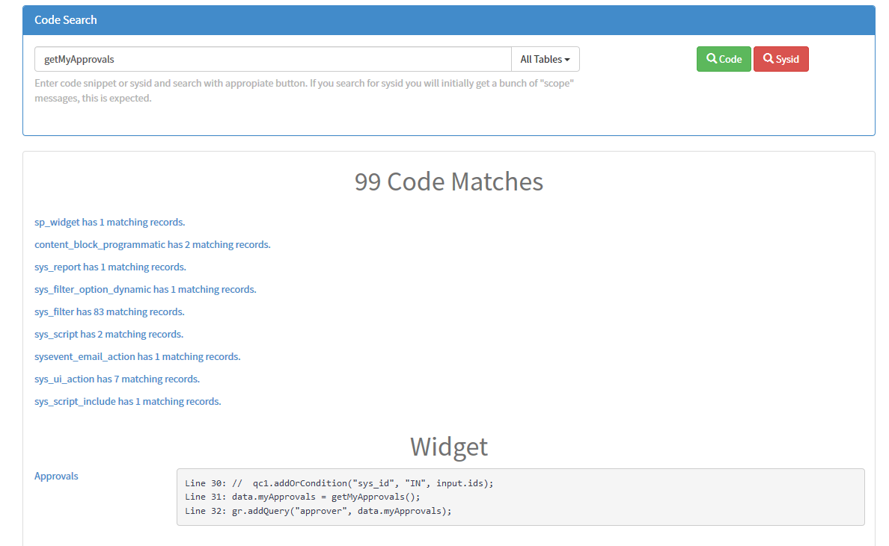

# Code Search

This is a scoped application for Service-now to allow easier searching all code sources.

---

## Features

- Table of contents of results
- Inline code that is found

---

## Setup

1. Open Studio on your environment
1. Import from source
1. Paste in the following url: `https://gitlab.com/jacebenson/servicenow-codesearch.git`

---

## Usage

After you import this you can start to use it by in the following ways;

- Navigating to `/$sp?id=code_search` on your instance and typing in your term
- Navigating to `/$sp?id=code_search&searchTerm=63be725bdb030300f7db793ebf961979` on your instance and waiting for it's response